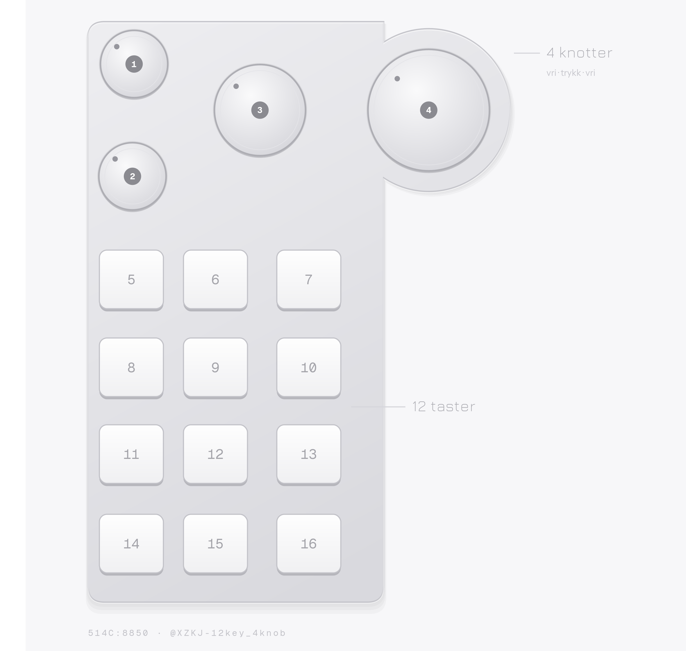
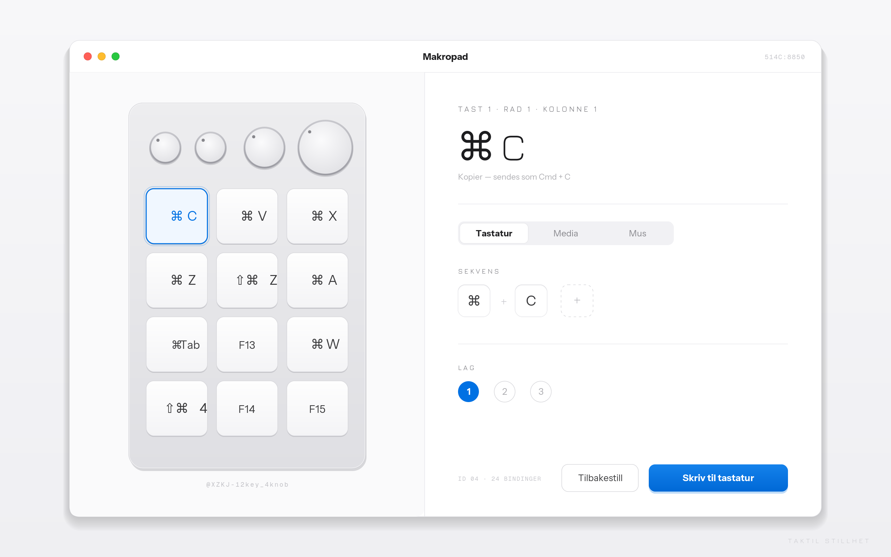

# macropad-mac

macOS-konfigurator for AliExpress-makropaden **XZKJ 12-key / 4-knob** (USB `514C:8850`) —
enheten som bare leveres med kinesisk Windows-programvare.

Protokollen er reverse-engineeret fra bunnen for denne varianten. Konfigurasjonen lagres i
tastaturets eget minne, så programvaren trengs bare når du endrer oppsettet.

## Er dette enheten din?



Tolv taster i 4×3, fire knotter — to små, én medium, én stor i en utstikkende lobe øverst til
høyre. Selges under mange navn. Sjekk USB-ID-en for å være sikker:

```bash
hidutil list | grep 514c
```

## Kom i gang

```bash
python3 -m venv .venv
.venv/bin/pip install hidapi pyyaml
.venv/bin/python app.py          # åpner http://127.0.0.1:8777
```



Klikk en tast eller knott, skriv inn bindingen, trykk **Skriv til tastatur**.

### CLI-alternativ

```bash
.venv/bin/python macroctl.py flash config.example.yaml
.venv/bin/python macroctl.py validate config.example.yaml
.venv/bin/python macroctl.py list-keys
```

## Bindingssyntaks

| Eksempel | Betydning |
|---|---|
| `cmd+c` | Cmd + C |
| `cmd+shift+4` | flere modifikatorer |
| `h,e,i` | sekvens av trykk (maks 18 inkl. modifikatorer) |
| `c@100` | 100 ms forsinkelse før trykket |
| `volumeup` / `volumedown` / `mute` | volumkontroll |
| `mouse:left` | museklikk (`left` / `right` / `middle`) |

Modifikatorer: `cmd` `shift` `alt` `ctrl`, samt `rshift`, `ralt` osv. for høyre side.
Hver knott gir tre uavhengige bindinger: **vri venstre · trykk · vri høyre**.

## Status

- ✅ Tastebindinger, modifikatorer, sekvenser, forsinkelser
- ✅ Volum opp/ned/mute
- ✅ Museklikk
- ⚠️ Play/pause/neste/forrige — consumer-side, format ennå ikke funnet
- ⬜ LED-styring
- ⬜ Lag 2 og 3 (protokollen støtter det; ikke testet)
- ⬜ App-avhengige lag (bakgrunnsprosess)

Se [docs/PROTOCOL.md](docs/PROTOCOL.md) for key-ID-kartet og protokolldetaljene.

## Takk til

[kriomant/ch57x-keyboard-tool](https://github.com/kriomant/ch57x-keyboard-tool), og særlig
[@yawor sitt arbeid i issue #153](https://github.com/kriomant/ch57x-keyboard-tool/issues/153)
som knekket `03 fd`-rammeformatet på en beslektet 16-key/3-knob-variant. Dette prosjektet
kartlegger 12-key/4-knob-varianten og finner at media-taster her bruker keyboard-siden,
ikke consumer-siden.

## Lisens

MIT
